# 🎸 UKM Band - Platform Musik Mobile & Backend API Glassmorphism

[](https://github.com/Ashlxxy/Tubes-Kelompok2-WebPro)
[](https://github.com/Ashlxxy/Tubes-Kelompok2-WebPro)

Repository ini berisi kode sumber lengkap untuk **UKM Band Music Streaming Platform** — platform musik digital khusus Unit Kegiatan Mahasiswa (UKM) Band Universitas Telkom. Platform ini terdiri dari **Aplikasi Mobile (Flutter)** bergaya premium dan **Web Portal & REST API (Laravel)** berbasis database SQLite terintegrasi dengan arsitektur modern bertema **Premium Dark Glassmorphism**.

---

## 📱 TAMPILAN APLIKASI MOBILE (FLUTTER) — PRIORITAS UTAMA

Berikut adalah tampilan antarmuka pengguna (UI/UX) pada aplikasi mobile Flutter yang mengadopsi tema **Premium Dark Glassmorphism** dengan pendaran neon merah crimson:

<table align="center">
  <tr>
    <td align="center" width="33%">
      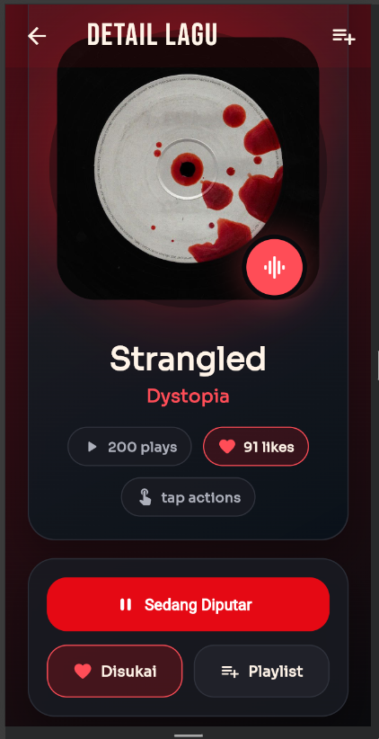<br/>
      <b>🎵 Detail Lagu & Pemutar</b>
    </td>
    <td align="center" width="33%">
      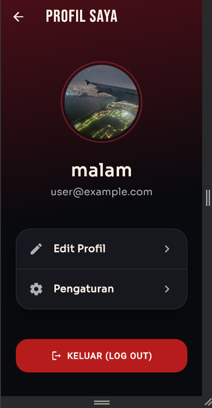<br/>
      <b>👤 Profil Saya</b>
    </td>
    <td align="center" width="33%">
      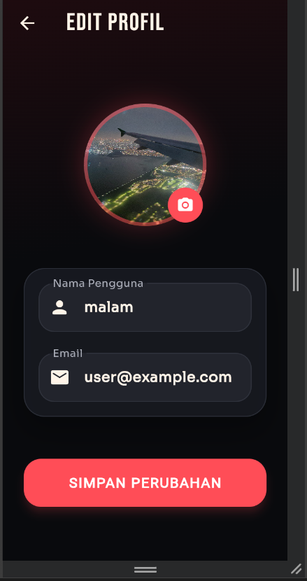<br/>
      <b>⚙️ Edit Profil</b>
    </td>
  </tr>
  <tr>
    <td align="center" width="33%">
      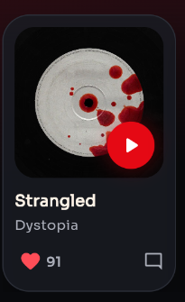<br/>
      <b>🖼️ Widget Kartu Lagu</b>
    </td>
    <td align="center" width="33%">
      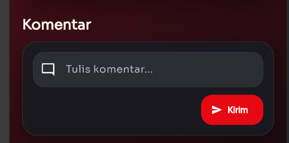<br/>
      <b>💬 Kolom Komentar</b>
    </td>
    <td align="center" width="33%">
      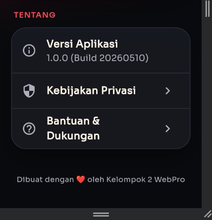<br/>
      <b>ℹ️ Tentang Aplikasi</b>
    </td>
  </tr>
</table>

---

## 🌐 TAMPILAN PORTAL WEB (LARAVEL OVERHAUL)

Website UKM Band telah **dirombak total secara global** agar memiliki desain **Glassmorphism** semi-transparan yang berpadu serasi dengan tema pendaran ambient mengambang dari versi mobile:

<table align="center">
  <tr>
    <td align="center" width="50%">
      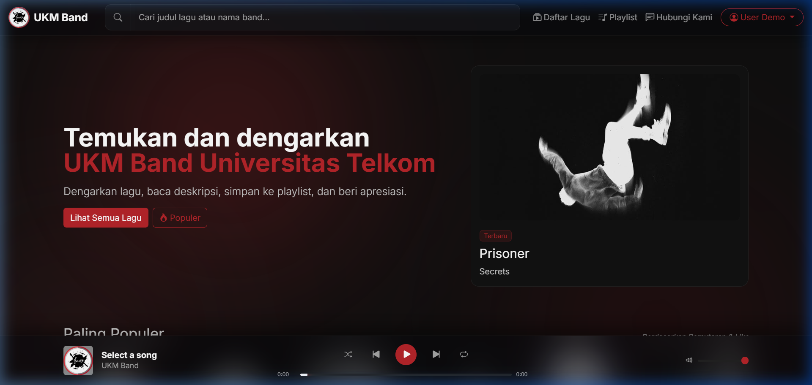<br/>
      <b>🌐 Landing Page (Glassmorphic Cards)</b>
    </td>
    <td align="center" width="50%">
      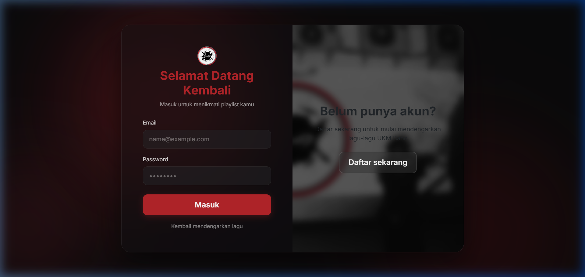<br/>
      <b>🔑 Portal Login Kaca Premium</b>
    </td>
  </tr>
  <tr>
    <td align="center" width="50%">
      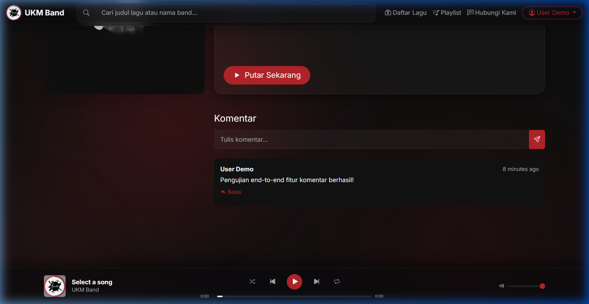<br/>
      <b>💬 Detail Lagu & Area Komentar</b>
    </td>
    <td align="center" width="50%">
      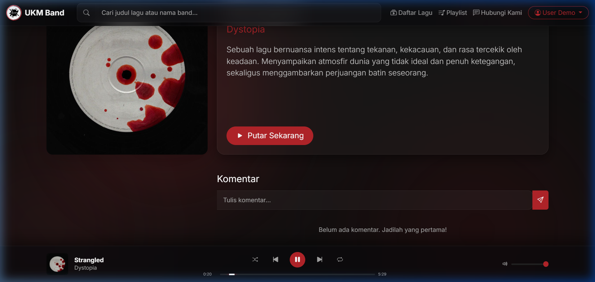<br/>
      <b>🎶 Pemutar Musik Aktif (WAV High-Res)</b>
    </td>
  </tr>
</table>

---

## 📂 Struktur Repositori

Proyek ini dibagi menjadi dua bagian utama:
*   `backend/` — Aplikasi backend berbasis Laravel 12 yang bertindak sebagai Web Server dan REST API untuk aplikasi mobile. Menggunakan SQLite untuk kenyamanan pengembangan lokal.
*   `ukm_band_mobile/` — Aplikasi musik mobile berbasis Flutter yang mengonsumsi REST API backend dan menggunakan state management Provider.

---

## 🔑 Kredensial Akun Default (Uji Coba)

Gunakan kredensial berikut untuk melakukan login dan menguji semua fitur platform:

| Peran (Role) | Email Pengguna | Kata Sandi (Password) | Keterangan Akses |
| :--- | :--- | :--- | :--- |
| **Administrator** | `admin@ukmband.telkom` | `admin123` | Akses penuh dashboard admin web portal (Ditolak pada aplikasi mobile) |
| **User Demo** | `user@example.com` | `password` | Akses streaming lagu, playlist, dan komentar di web maupun aplikasi mobile |

---

## 🛠️ Panduan Instalasi & Pengaktifan Lokal

### 1. Web Portal & REST API (Laravel)

#### Persyaratan Sistem
*   PHP >= 8.2 (dilengkapi ekstensi pdo_sqlite)
*   Composer
*   Node.js & npm

#### Langkah Instalasi
1.  Masuk ke direktori backend:
    ```bash
    cd backend
    ```
2.  Pasang dependensi PHP dan Javascript:
    ```bash
    composer install
    npm install
    ```
3.  Salin file konfigurasi lingkungan:
    ```bash
    cp .env.example .env
    php artisan key:generate
    ```
4.  Konfigurasikan database SQLite pada file `.env`:
    ```env
    DB_CONNECTION=sqlite
    # Hapus baris DB_DATABASE, DB_USERNAME, DB_PASSWORD bawaan lainnya
    ```
5.  Jalankan migrasi database beserta data awal (seeder) yang mencakup data lagu beresolusi tinggi (WAV) asli dari mobile:
    ```bash
    php artisan migrate:fresh --seed
    ```
6.  Hubungkan direktori penyimpanan media:
    ```bash
    php artisan storage:link
    ```
7.  Kompilasi aset front-end dan jalankan server lokal:
    ```bash
    npm run build
    php artisan serve
    ```
    *Portal Web akan aktif pada alamat `http://127.0.0.1:8000` dan REST API pada `http://127.0.0.1:8000/api`.*

> **Tips:** Apabila pemutaran lagu WAV berukuran besar mengalami kendala limit memori, jalankan PHP server dengan parameter tambahan berikut:
> `php -d upload_max_filesize=100M -d post_max_size=100M -S 127.0.0.1:8000 -t public`

---

### 2. Aplikasi Mobile (Flutter)

#### Persyaratan Sistem
*   Flutter SDK (versi terbaru disarankan)
*   Android Studio / VS Code dengan plugin Flutter terpasang
*   Emulator Android atau perangkat fisik untuk pengujian

#### Langkah Instalasi
1.  Masuk ke direktori aplikasi mobile:
    ```bash
    cd ukm_band_mobile
    ```
2.  Ambil dependensi proyek:
    ```bash
    flutter pub get
    ```
3.  Sesuaikan alamat REST API backend:
    *   Buka file `lib/services/api_service.dart`.
    *   Untuk pengujian emulator Android standar, endpoint default adalah `http://10.0.2.2:8000`.
    *   Jika menggunakan perangkat fisik, ubah `baseUrl` menjadi IP lokal komputer server Anda (contoh: `http://192.168.1.10:8000`).
4.  Jalankan aplikasi pada perangkat pengujian:
    ```bash
    flutter run
    ```

---

## 📊 Diagram Relasi Database (Class Diagram)

Berikut adalah rancangan hubungan tabel basis data yang mendukung seluruh fitur terintegrasi di dalam platform UKM Band:

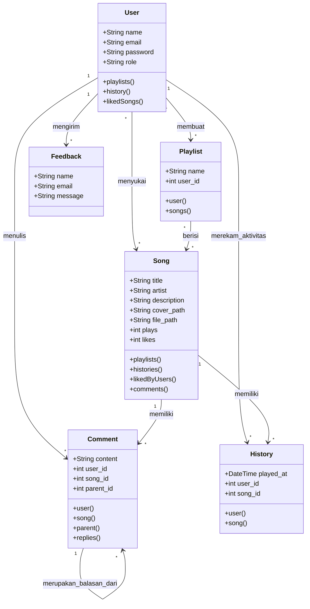

---
Dibuat dengan penuh dedikasi oleh **Kelompok 2 WebPro (Tubes-APB)**. Selamat mendengarkan karya musik terbaik anak bangsa! 🎧🔥
